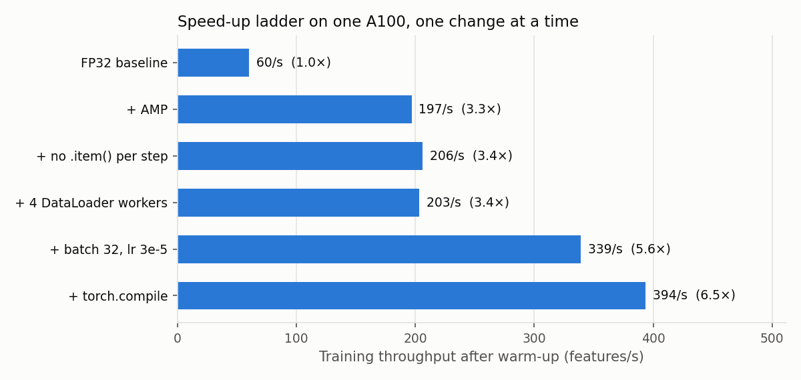
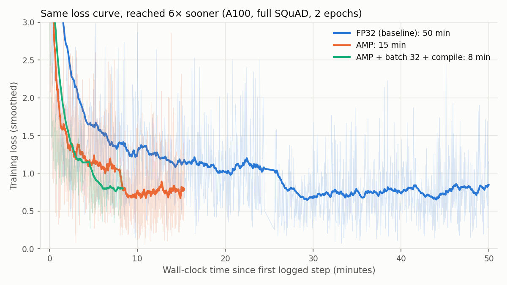

# BERT-SQUAD Training BASELINE
Fine-tuning of `google-bert/bert-base-uncased` for question answering on SQuAD v1.1 (`rajpurkar/squad`), trained and measured on one NVIDIA A100 on FinisTerrae III. The data pipeline and evaluation are adapted from the Hugging Face course (chapter 7, *Question answering*), with a plain PyTorch training loop.

---

## 1. Repository contents (`BASELINE/`)

| File or folder | Purpose |
|---|---|
| `bert_lab.py` | The training script (see section 2) |
| `train_a100.sh` | SLURM job script for one A100 (`short` partition, 32 CPUs, 32 GB RAM) |
| `train.sh` | SLURM job script for one T4 (`viz` partition), used for tests and a comparison run |
| `env_setup.sh` | Creates the Python venv (modules `cesga/2022` + `python/3.10.8`) and installs the pinned packages |
| `requirements.txt` | Exact package versions, including `torch 2.11.0+cu128` (a CUDA 12.8 build matching FT3's GPU driver) |
| `plot_results.py` | Builds the figures in `figures/` from the TensorBoard logs |
| `logs/` | SLURM output of every run reported below |
| `runs/` | TensorBoard logs of those runs, and the profiler traces (`trace.json.gz`, which opens in ui.perfetto.dev) |
| `figures/` | Figures used in this README |

The job name given to `sbatch -J <name>` names everything belonging to a run: `logs/<name>-<jobid>.out`, `runs/<name>/` and the checkpoint `$STORE/checkpoints/<name>/checkpoint.pt`.

---

## 2. The training script (`bert_lab.py`)

- **Data:** question and context are tokenized together (max 384 tokens). Long contexts are split into overlapping windows (stride 128), giving 88,492 training features. Windows that don't contain the answer are labeled with position 0 (`[CLS]`), and `token_type_ids` are passed to the model.
- **Evaluation:** EM and F1 with the official SQuAD metric, after each epoch.
- **Precision switch:** `--precision fp32` or `amp` (FP16 `torch.autocast` + `GradScaler`). Both use the same code path; in FP32 the autocast and scaler are disabled.
- **Checkpointing:** after every epoch, the model, optimizer, gradient scaler, epoch and step counter are saved. Resubmitting the same job resumes after the last completed epoch.
- **TensorBoard logging:** training loss every 20 steps, and per epoch the loss, EM/F1, training and evaluation times, throughput. At the end, the run's options and final numbers (hparams).
- **Measurements, printed in the log:**
  - training time per epoch and in total (training loop only, with `torch.cuda.synchronize()` before each clock reading)
  - evaluation time, separately
  - throughput in features/s, after a 50-step warm-up
  - peak GPU memory (`torch.cuda.max_memory_allocated()`)
  - the run's options, library versions and GPU at the top of each log
- **Optimization options:** mixed precision, DataLoader workers, batch size, `torch.compile` (with `drop_last=True` so the last batch doesn't trigger a recompilation).
- **Profiling:** `--profile` records a few training steps with `torch.profiler`, prints the operations sorted by GPU time, exports a timeline trace, then exits.
- **Reproducibility:** fixed seed.

### Options

| Option | Default | Meaning |
|---|---|---|
| `--precision {fp32,amp}` | `fp32` | full FP32, or automatic mixed precision (FP16) |
| `--epochs` | 2 | number of epochs |
| `--batch-size`, `--lr` | 8, 2e-5 | batch size and AdamW learning rate |
| `--data-fraction` | 1.0 | fraction of SQuAD to use (for quick tests) |
| `--num-workers` | 0 | DataLoader worker processes |
| `--compile` | off | wrap the model with `torch.compile` |
| `--profile` | off | profile a few training steps, then exit |
| `--warmup-steps` | 50 | steps skipped before measuring throughput |
| `--seed` | 42 | random seed |
| `--log-dir`, `--ckpt-path` | from the job name | TensorBoard folder and checkpoint path |

---

## 3. Results

### 3.1 Baseline and mixed precision (A100, full SQuAD, 2 epochs, batch 8)

| | **FP32 (baseline)** | **AMP** | AMP vs FP32 |
|---|---|---|---|
| Epoch training times | 1,472.7 s / 1,466.4 s | 454.1 s / 445.1 s | |
| **Total training time** | **2,939.1 s (49.0 min)** | **899.2 s (15.0 min)** | **3.27× faster** |
| Throughput | 60.2 features/s | 196.8 features/s | 3.27× |
| Total evaluation time | 128.7 s | 41.0 s | 3.14× |
| Peak GPU memory | 3.11 GB | 2.65 GB | −15% |
| **Final EM / F1** | **80.4 / 87.7** | **80.1 / 87.5** | same quality |

### 3.2 Optimization ladder (A100, AMP, 20% of SQuAD, 1 epoch)

Each rung adds one change on top of the previous one. Throughput is measured after the warm-up.

| Rung | Change | Throughput | vs previous | vs FP32 baseline | Peak memory |
|---|---|---|---|---|---|
| — | FP32 baseline | 60.2 | — | 1.00× | 3.11 GB |
| a | mixed precision (AMP) | 196.8 | 3.27× | 3.27× | 2.65 GB |
| b | no `.item()` at every step | 206.0 | 1.05× | 3.42× | 2.65 GB |
| c | + 4 DataLoader workers | 203.2 | 0.99× | 3.38× | 2.65 GB |
| d | + batch size 32, learning rate 3e-5 | 339.3 | 1.67× | 5.64× | 6.18 GB |
| e | + `torch.compile` | 393.6 | 1.16× | 6.54× | 5.57 GB |
| f | batch size 64, learning rate 5e-5 | 440.3 | 1.12× | 7.31× | 9.71 GB |

### 3.3 Final optimized run (A100, full SQuAD, 2 epochs)

`--precision amp --batch-size 32 --lr 3e-5 --compile`

| | FP32 baseline | AMP | **AMP optimized** |
|---|---|---|---|
| Epoch training times | 1,472.7 / 1,466.4 s | 454.1 / 445.1 s | 259.7 / 230.5 s |
| **Total training time** | 2,939.1 s | 899.2 s | **490.2 s (8.2 min)** |
| **Speed-up vs baseline** | 1.00× | 3.27× | **6.00×** |
| Throughput after warm-up | — | — | 385.8 / 383.9 features/s |
| Total evaluation time | 128.7 s | 41.0 s | 50.9 s |
| Peak GPU memory | 3.11 GB | 2.65 GB | 5.57 GB |
| **Final EM / F1** | 80.4 / **87.7** | 80.1 / **87.5** | 80.2 / **87.6** |

*Times in the legend are wall-clock and include the evaluation between the two epochs (the flat segments); the tables report training time only.*

### 3.4 The same code on a T4 (full SQuAD, 2 epochs, batch 8)

| | A100 FP32 | A100 AMP | T4 FP32 | T4 AMP |
|---|---|---|---|---|
| Total training time | 2,939 s | 899 s | 12,496 s (3.5 h) | 3,808 s |
| Throughput (features/s) | 60.2 | 196.8 | 14.2 | 46.5 |
| Peak GPU memory | 3.11 GB | 2.65 GB | 3.11 GB | 2.63 GB |
| Final F1 | 87.7 | 87.5 | 87.3 | 87.6 |

---

## 4. Profiling (`torch.profiler`)

Each profile skips 5 steps, warms up for 2 and records 5 training steps. The traces are in `runs/prof_*/trace.json.gz`.

| | FP32, batch 8 | AMP, batch 8 | AMP + batch 32 + compile |
|---|---|---|---|
| GPU busy time per step | ~142 ms | ~31 ms | ~78 ms |
| Wall time per step (profiled) | ~130 ms | ~65 ms | ~83 ms |
| **GPU busy fraction** | **~100%** | **~48%** | **~94%** |
| Largest GPU costs | matrix multiplications ≈ 69% (FP32 `ampere_sgemm` kernels) | AdamW step 22%, matmuls 19%, attention backward 11%, casts/copies 9% | two fused compiled graphs |

- **FP32 is compute-bound:** the GPU is busy the whole step with FP32 matrix multiplications that don't use the Tensor Cores, so lower precision is what helps.
- **AMP at batch 8 leaves the GPU idle about half of each step,** waiting for the CPU, and the AdamW update is the largest single cost. A larger batch and fused kernels fix this; more DataLoader workers don't.
- **With batch 32 and compile, the GPU is busy about 94% of the time,** which is why going to batch 64 gave only 1.12×.